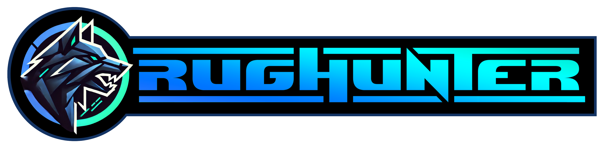

</img>

<h1>Rughunter: Redefining Security in Web3</h1>
<TT>|-- coming soon --|</TT>
<h2>How Rughunter Works</h2>
<ol>
    <li>
        <strong>Localized Monitoring</strong> 
        Transactions are analyzed directly on the user’s device, ensuring complete privacy by keeping sensitive data local.
    </li>
    <li>
        <strong>Threat Data Usage</strong> 
        Sanitized threat pattern data, stripped of any personal identifiable information (PII), is encrypted and securely transmitted for continuous analysis and AI model training. User privacy remains a top priority throughout this process.
    </li>
    <li>
        <strong>Advanced Threat Analysis</strong> 
        Rughunter employs state-of-the-art methodologies to detect risky transaction patterns and behaviors, providing unparalleled protection against threats.
    </li>
    <li>
        <strong>User Empowerment</strong> 
        When a transaction is flagged as suspicious, users are immediately alerted with clear, actionable options, keeping them in control of their decisions at all times.
    </li>
    <li>
        <strong>Continuous Evolution</strong> 
        Adaptive technology ensures Rughunter improves constantly, allowing it to identify even the most sophisticated and emerging threats in real-time.
    </li>
</ol>

<h2>What Sets Rughunter Apart</h2>
<ul>
    <li>
        <strong>Unmatched Privacy</strong> 
        Rughunter’s analysis occurs entirely on the user’s device. Only anonymized and encrypted threat patterns are shared for improving threat detection, ensuring that user privacy is never compromised.
    </li>
    <li>
        <strong>Proactive Security</strong> 
        Rughunter evaluates and intercepts transactions before they are confirmed, stopping scams and malicious activities before they can cause harm.
    </li>
    <li>
        <strong>Innovative Technology</strong> 
        By leveraging cutting-edge methodologies not widely implemented in the industry, Rughunter is redefining the standard for security in web3.
    </li>
    <li>
        <strong>Cross-Platform Compatibility</strong> 
        Rughunter is built to operate across multiple blockchains and off-chain systems, providing comprehensive protection no matter where users interact in the web3 ecosystem. As of January 2025, Rughunter’s AI boasts an impressive 99.7% accuracy in detecting and predicting threats during live transactions, with the goal of reaching 100% accuracy in the near future.
    </li>
</ul>

<h2>Your Safety, Our Priority</h2>

    Rughunter represents a paradigm shift in decentralized security. By integrating advanced technologies, user-centric design, and real-time threat detection, Rughunter delivers unparalleled protection while maintaining complete privacy and control for every user.

    This is more than a tool—it’s the foundation for a safer, more accountable, and trustworthy web3. Together, we’re building a future where innovation thrives, scams are eradicated, and trust is restored.

  
"We are very excited for the future and look forward to letting this monster loose and bring accountability back to web3!"
  
-Rughunter Team-
